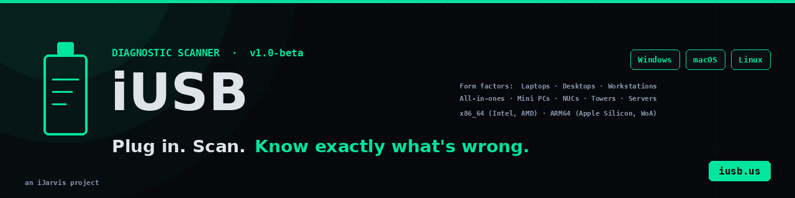

<div align="center">
  

  <h3>Plug in. Scan. Know exactly what's wrong.</h3>
</div>

<p align="center">
  <a href="LICENSE"></a>
  <a href="#status"></a>
  <a href="#supported-platforms"></a>
  <a href="https://iusb.us"></a>
  <a href="SECURITY.md"></a>
</p>

<p align="center">
  <strong>Portable USB diagnostic toolkit for repair shops, IT departments, and MSPs.</strong><br>
  Runs from a USB stick. Reads the system. Writes a customer-ready report. Leaves no trace.
</p>

---

## Contents

- [What iUSB is](#what-iusb-is)
- [Status](#status)
- [Supported platforms](#supported-platforms)
- [The 10 modules](#the-10-modules)
- [How it works](#how-it-works)
- [Installation](#installation)
- [Usage](#usage)
- [The customer-facing report](#the-customer-facing-report)
- [Configuration](#configuration)
- [Privacy and security](#privacy-and-security)
- [FAQ](#faq)
- [Roadmap](#roadmap)
- [Contributing](#contributing)
- [License](#license)
- [Contact](#contact)

---

## What iUSB is

iUSB is a cross-platform diagnostic scanner for computer repair technicians. You plug a USB stick into a customer's machine, run a single command, and get back a triaged report that lists what's wrong, how severe each issue is, how long each repair will take, and what your shop charges to fix it.

Three things make iUSB different from the existing toolkit landscape:

1. **One tool covers Windows, macOS, and Linux.** No need to swap between separate vendor utilities. The scanner detects the operating system at launch and runs the right native commands for that platform.
2. **It's read-only and offline.** The Community edition makes no network calls, installs nothing, leaves no registry keys or scheduled tasks, and writes its report to the USB stick rather than the customer's machine. Pull the stick and there's no trace left behind.
3. **The report is for the customer, not the technician.** Severity badges (CRIT / WARN / INFO / PASS), plain-English explanations of each finding, time estimates, and your shop's labor rate baked into the cost column. Hand it to a customer and they can read it without help.

The website at [iusb.us](https://iusb.us) is the marketing front. This repository is the technical home.

## Status

**Private beta as of May 2026.** The Community scanner is running in production at a small handful of repair shops while we harden edge cases (BitLocker-protected drives, ARM Macs, exotic Linux distros, Server editions). The plan:

| Milestone | Target | Status |
|---|---|---|
| Private beta with selected shops | Q2 2026 | In progress |
| Public release of source under MIT license | Q3 2026 | Scheduled |
| Pro tier (cloud dashboard, AI triage) | Q3 2026 | Design phase |
| Enterprise tier (SSO, audit logs, on-prem) | Q4 2026 | Spec phase |

Want a slot? [Request early access](https://iusb.us/#early-access).

The source code for the scanner ships in `src/` once the public release lands. Until then, this repository serves as the public documentation home, the security disclosure channel, the issue tracker for early-access shops, and the roadmap.

## Supported platforms

iUSB runs on every form factor where you can plug in a USB stick and reach a normal shell. The Battery module reports "no battery present" on machines without one; every other module behaves identically across form factors.

**Form factors:** Laptops · Desktops · All-in-ones · Workstations · Mini PCs · NUCs · Towers · Servers · Chromebooks (in Linux mode)

**Architectures:** x86_64 (Intel, AMD) · ARM64 (Apple Silicon, Windows on ARM, ARM Linux)

| OS family | Versions | Native tools used |
|---|---|---|
| **Windows** | 10, 11, Server 2019, Server 2022, Windows on ARM | WMI / CIM, Event Viewer, PowerShell 5.1+, Defender status, powercfg, optional smartmontools |
| **macOS** | 12 (Monterey) through latest, Intel + Apple Silicon M1 to M4+ | system_profiler, diskutil, ioreg, pmset, sysctl, Gatekeeper / SIP / FileVault checks, optional smartmontools |
| **Linux** | Ubuntu, Debian, Fedora, RHEL, Rocky Linux, AlmaLinux, Arch, openSUSE, Linux Mint, Pop!\_OS | dmidecode, lscpu, smartctl, lm-sensors, journalctl, systemd-analyze, upower, ufw / firewalld, package manager autodetect for apt / dnf / pacman / zypper, /sys and /proc inspection |

If your distro isn't listed and uses systemd plus one of those package managers, iUSB very likely works. File a [scanner compatibility report](.github/ISSUE_TEMPLATE/scanner_compatibility.md) if it doesn't and we'll add it.

## The 10 modules

| # | Module | What it reads |
|---|---|---|
| 1 | System ID | Manufacturer, model, serial number, BIOS/UEFI version, OS version, uptime |
| 2 | CPU & Thermals | Temperature, load, throttling detection, fan RPM (where exposed) |
| 3 | Memory | Capacity, usage, slot info, memory pressure analysis |
| 4 | Disk / SMART | SMART health, reallocated sectors, pending sectors, volume space, fragmentation |
| 5 | Battery | Cycle count, health %, design vs actual capacity (laptops, tablets, UPS) |
| 6 | Network | DNS resolution, adapter status, latency probes, signal strength on wireless |
| 7 | Security | AV status, firewall posture, OS update age, disk encryption state |
| 8 | Services & Logs | Failed services / systemd units, recent BSODs / kernel panics, repeating error events |
| 9 | Boot Performance | Boot time breakdown, startup item enumeration, uptime |
| 10 | Software Audit | PUP / adware detection, bloatware identification, unsigned binaries flagged |

Each module produces one or more findings. Each finding has a severity, a plain-English title, an explanation, a recommended action, and an estimated repair time.

## How it works

```
   ┌──────────────────┐    ┌──────────────────┐    ┌──────────────────┐    ┌──────────────────┐
   │   1. PLUG IN     │ -> │  2. AUTORUN      │ -> │  3. SCAN         │ -> │  4. REPORT       │
   │  USB into any    │    │  launcher.sh /   │    │  10 modules in   │    │  HTML report     │
   │  machine         │    │  launcher.ps1    │    │  60 to 90s       │    │  written to USB  │
   └──────────────────┘    └──────────────────┘    └──────────────────┘    └──────────────────┘
```

The launcher detects the OS at start and dispatches to the platform-specific scanner:

```
iusb/
├── launcher.sh         # Cross-platform entry for macOS and Linux
├── launcher.ps1        # Windows entry
├── scanners/
│   ├── windows/        # PowerShell modules
│   ├── macos/          # Bash + native macOS tools
│   └── linux/          # Bash + per-distro adapters
├── report/             # HTML report generator
└── config.json         # Shop branding, pricing, thresholds
```

Each scanner module is independent and produces a JSON fragment. The report generator joins the fragments, applies severity sorting and shop-specific pricing from `config.json`, and writes a single self-contained HTML file to the USB stick.

## Installation

> Available with the public release. During private beta, early-access shops receive a signed download bundle via email and a 15-minute walkthrough call.

After public release, the install will look like this:

**Windows (PowerShell):**
```powershell
# From a clean USB stick (drive letter may vary)
PS> D:\launcher.ps1
```

**macOS (Terminal):**
```bash
# /Volumes/IUSB is the default mount name for the iUSB USB stick
$ /Volumes/IUSB/launcher.sh
```

**Linux (any shell):**
```bash
# /media/iusb is the typical mount point (adjust for your distro)
$ /media/iusb/launcher.sh
```

The launcher does not require root or admin rights for the standard modules. A few optional deep checks (kernel logs on Linux, full Defender history on Windows) will prompt for elevation; the launcher tells you up front and you can skip them.

## Usage

The default run scans all 10 modules and writes a report to `report-YYYY-MM-DD-HHMMSS.html` next to the launcher. Common flags (preview):

```
launcher --quick           Run only critical-severity modules (system, disk, security)
launcher --skip BATTERY    Skip a module by name
launcher --only SMART      Run only the named modules
launcher --output PATH     Write the report somewhere other than the USB stick
launcher --config FILE     Use a non-default config file
launcher --json            Emit raw JSON instead of HTML
```

## The customer-facing report

The report is a single HTML file that opens in any browser, formatted to print or save as PDF without modification. A representative example is in [`examples/report-example.html`](examples/report-example.html).

Five visual elements:

1. **Header** with your shop's logo, customer name, and prepared-for date
2. **Severity-sorted findings list** with CRIT / WARN / INFO / PASS badges
3. **Plain-English explanation** for each finding (no jargon)
4. **Time and cost columns** using your shop's labor rate
5. **Footer summary** with total repair time and total estimated cost

Every visual element is customizable through `config.json`. See [docs/report-format.md](docs/report-format.md).

## Configuration

`config.json` controls the rebrandable parts of the report and the scanner thresholds. A starter configuration is in [`examples/config.example.json`](examples/config.example.json). Full schema reference: [docs/config.md](docs/config.md).

Common fields:

```json
{
  "shop": {
    "name": "Acme Computer Repair",
    "logo_path": "logo.png",
    "labor_rate_per_hour_usd": 95,
    "minimum_charge_usd": 30
  },
  "thresholds": {
    "battery_health_warn_pct": 80,
    "battery_health_crit_pct": 60,
    "smart_pending_sectors_warn": 1,
    "boot_time_warn_seconds": 60
  },
  "modules": {
    "skip": [],
    "battery_required": false
  }
}
```

## Privacy and security

iUSB is built around four hard rules:

1. **No network calls during a scan.** The Community edition is fully offline. Pro will add explicit opt-in cloud features.
2. **No installation.** Nothing is written to the customer's machine outside of optionally elevated diagnostic commands. Reports are written to the USB stick.
3. **No personal data is read.** The scanner reads system inventory, hardware state, security configuration, and event logs. It does not read user files, browsing history, saved passwords, photos, or messages.
4. **No telemetry, ever.** The Community edition does not phone home. Period.

Vulnerability disclosure: see [SECURITY.md](SECURITY.md) or email hello@ijarvis.ai. A signed [`.well-known/security.txt`](https://iusb.us/.well-known/security.txt) is published on the website.

## FAQ

**Does iUSB require admin or root rights on the customer's machine?**

Most modules read information available to any signed-in user. A handful of optional deep checks may prompt for elevation; the launcher tells you up front and you can skip them. The scanner never installs anything or persists past unplug.

**Will it trip Windows Defender or third-party antivirus?**

The Windows scanner is plain PowerShell calling WMI / CIM and built-in Windows utilities. No obfuscation, no compiled binary lacking a signature, no network calls. Zero detections on stock Defender in beta testing. The source is published openly on release, so any AV vendor or IT team can audit it.

**What does it actually change on the customer's machine?**

Nothing. Community edition is strictly read-only. Fix scripts ship separately and are opt-in; the technician reviews and runs them with the customer's authorization.

**Does it work on desktops, workstations, and servers, or just laptops?**

All form factors are supported. iUSB reads the operating system's view of the hardware, so form factor does not matter. The Battery module reports "no battery present" on desktops and servers; every other module runs identically. See [Supported platforms](#supported-platforms) for the full architecture and distro list.

**When can I actually get it on a USB stick?**

The Community scanner is in private beta. [Request early access at iusb.us/#early-access](https://iusb.us/#early-access) and you'll get a signed download bundle plus a walkthrough call when your slot opens.

Full FAQ on the website: [iusb.us/#faq](https://iusb.us/#faq).

## Roadmap

See [ROADMAP.md](ROADMAP.md). Highlights:

- **v1.0 (Q3 2026):** Public release of Community edition, source under MIT
- **v1.1:** Printer queue diagnostics, USB device enumeration, Bluetooth audit
- **v1.5:** Localization (Spanish, French, Brazilian Portuguese first)
- **Pro (Q3 2026):** AI-powered finding triage via Claude API, cloud dashboard, multi-tech fleet view
- **Enterprise (Q4 2026):** SSO / SAML / SCIM, audit logs, on-prem deployment, air-gapped environments

## Contributing

Once public release lands, contributions are warmly welcome. Before then, the most useful contributions are:

- **Scanner compatibility reports** when iUSB fails on a specific OS / distro / hardware combination ([file one](.github/ISSUE_TEMPLATE/scanner_compatibility.md))
- **Bug reports** for early-access shops running the beta ([file one](.github/ISSUE_TEMPLATE/bug_report.md))
- **Feature requests** with concrete shop workflows ([file one](.github/ISSUE_TEMPLATE/feature_request.md))

Read [CONTRIBUTING.md](CONTRIBUTING.md) for the full contribution guide and [CODE_OF_CONDUCT.md](CODE_OF_CONDUCT.md) for the community standards.

## License

The scanner and report code will be released under the [MIT License](LICENSE) at public launch. During private beta, the source is distributed to early-access shops under MIT with the same terms.

The MIT-license file in this repo is the canonical version that will apply to the source. Everything in this repository today (documentation, examples, banner, schema, configs) is already MIT-licensed.

## Contact

- **Website:** https://iusb.us
- **Email:** hello@ijarvis.ai
- **Security disclosure:** see [SECURITY.md](SECURITY.md)
- **Org:** https://github.com/ijarviscom
- **Publisher:** [iJarvis LLC](https://ijarvis.ai), Tampa, FL

---

<p align="center">
  <sub>iUSB is an iJarvis project. Built for repair shops, IT departments, and MSPs that care about doing the work right.</sub>
</p>
